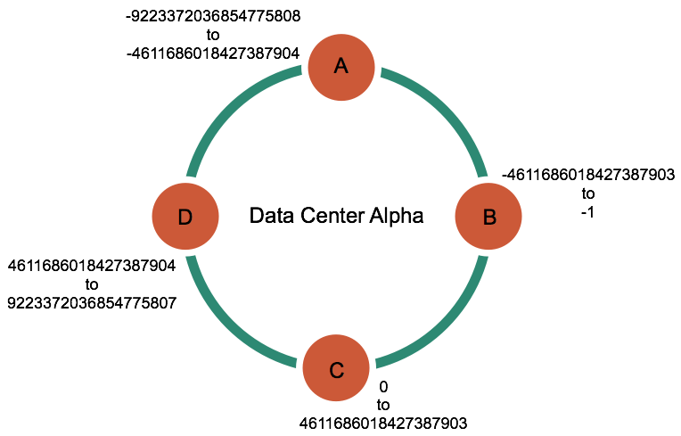
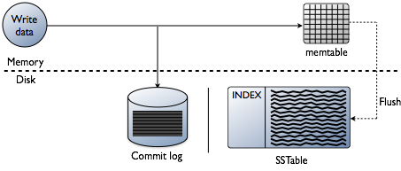
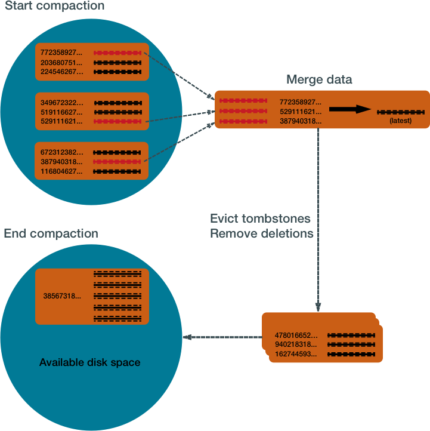
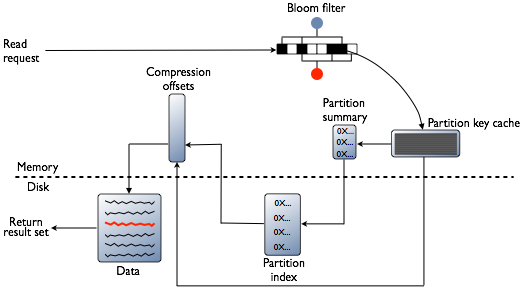
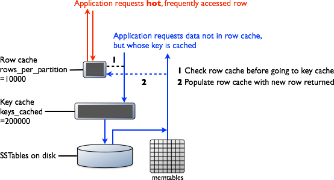

[Apache Cassandra](https://cassandra.apache.org/_/index.html) is a massively scalable, **NoSQL database** capable of handling petabytes of information and thousands of concurrent users/operations per second. Perfect for managing humongous amounts of structured, semi-structured and unstructured data across multiple data centers and the cloud. Cassandra delivers **continuous availability (different from high availability), linear scalabilty and operational simplicity across servers with no single point of failure**.

## Some really interesting features of Apache Cassandra

- Cassandra is a **partitioned row-store database**, meaning data is distributed across nodes and stored as rows. It uses **CQL (Cassandra Query Language)**, which has SQL-like syntax.
- It **automatically distributes the data across all the participating nodes in a database cluster**. This removes the programming complexity for the developers.
- It has a **built-in and customizable data replication**, that replicates the data across participating nodes. If any node goes down others take over without data loss.

- Cassandra provides near-linear scalability, **adding more nodes increases throughput proportionally** (e.g doubling nodes ≈ doubling capacity)

## Client Connection and Coordinator Selection

Every request in Cassandra starts with a client connecting to a node in a database cluster. This node is known as the **coordinator node**. It is important to note that there is **no concept of a master node** in Apache Cassandra - **any node can coordinate any request**.

The coordinator's role is to

- Accept the write request from the client
- Determine which nodes should store replicas of the data
- Forward the write to those replica nodes
- Wait for acknowledgments based on the consistency level
- Respond to the client

The coordinator doesn’t necessarily store the data itself, it determines which nodes in the ring should get the request based on how the cluster is configured.

## Data Distribution and Replication Strategy

Before writing the data, it needs to determine how the data is distributed across participating nodes and select the replica nodes to store the replica on.

Cassandra uses consistent hashing to distributes the data across the nodes. Read on how [consistent hashing](https://docs.datastax.com/en/cassandra-oss/3.x/cassandra/architecture/archDataDistributeHashing.html) works in cassandra.

In short, every piece of data has a partition key in cassandra. This key is hashed using a [partitioner](https://docs.datastax.com/en/cassandra-oss/3.x/cassandra/architecture/archPartitionerAbout.html) (typically [Murmur3Partitioner](https://docs.datastax.com/en/cassandra-oss/3.x/cassandra/architecture/archPartitionerM3P.html)) to produce a 64-bit token which determines where the data lives in the cluster

For example, if you have a table

```sql
CREATE TABLE users (
  user_id uuid PRIMARY KEY,
  name text,
  email text
);
```

This `user_id` is hashed to produce a token, and this token falls within a range owned by a specific node in a cluster as shown below.



<p align="center">
    <em>Source: Apache Cassandra Documentation</em>
</p>

### Replication Strategy

It determines how many copies of data and where they should exist in a cluster. There are two strategies available.

- **SimpleStrategy:** Use only for a single datacenter and one rack. SimpleStrategy places the first replica on a node determined by the partitioner. Additional replicas are placed on the next nodes clockwise in the ring without considering topology (rack or datacenter location).

- **NetworkTopologyStrategy:** when you have (or plan to have) your cluster deployed across multiple datacenters. This strategy specifies how many replicas you want in each datacenter. For example:

```sql
CREATE KEYSPACE my_app WITH REPLICATION = {
  'class': 'NetworkTopologyStrategy',
  'DataCenter1': 3,
  'DataCenter2': 2
};
```

## How is data written?

Once the coordinator determines which node should receive the writes, it forwards the requests to those nodes.

Cassandra processes data at several stages on the write path, starting with the immediate logging of a write and ending in with a write of data to disk:

- Logging data in the commit log
- Writing data to the memtable
- Flushing data from the memtable
- Storing data on disk in SSTables

### commit log

The very first thing happens when a node receives a write is to **logs the write to the commit log**. This is the critical step to ensure durability. **`CommitLog` is an append-only log file on disk**, which is extremely fast and modern SSDs can handle hundreds of thousands of sequential logs per second.

By logging writes, Cassandra ensures the writes are never lost, even if the node crashes, can be recovered later from the disk when the node restarts.

### memtable

Immediatley after writing to the commiLog, the writes are written to on an **in-memory structure** called a `memtable`. Each table is Cassandra has its own memtable.

It **stores data in a sorted order until reaching a configurable limit**, and then is flushed. The memtable is a write-back cache of data partitions that Cassandra looks up by key.

```bash
Partition Key: user_147
├─ Clustering: timestamp=2025-01-15T10:00:00, value="xxxx"
├─ Clustering: timestamp=2025-01-15T10:05:00, value="xxxxxxxx"
└─ Clustering: timestamp=2025-01-15T10:10:00, value="xxxxxx"

Partition Key: user_456
├─ Clustering: timestamp=2025-01-15T10:02:00, value="xxxxxxxxxx"
└─ Clustering: timestamp=2025-01-15T10:12:00, value="xxxxx"
```

### Flushing the data from the memtable

After reaching the configurable limit, memtable is flushed and writes are transferred to the disk in the memtable-sorted order. You can also amnually flush the memtable and transfer writes to the disk.

Data in the commit log is purged after its corresponding data in the memtable is flushed to an SSTable on disk.

### SSTables

SSTables are immutable, not written to again after the memtable is flushed. Memtables and SSTables are maintained per table. The commit log is shared among tables.



<p align="center">
    <em>Source: Apache Cassandra Documentation</em>
</p>

## How is data maintained?

The Cassandra write process stores data in files called SSTables. SSTables are immutable. **Instead of overwriting existing rows with inserts or updates, Cassandra writes new timestamped versions of the inserted or updated data in new SSTables.**

However, immutability means we accumulate multiple SSTables over time. To keep the database healthy, Cassandra periodically merges SSTables and discards old data. This process is called [compaction](https://docs.datastax.com/en/cassandra-oss/3.x/cassandra/dml/dmlHowDataMaintain.html#Compaction).

### Compaction

It collects all versions of each unique row and assembles one complete row, using the most up-to-date version (by timestamp) of each of the row's columns. The merge process is performant, because rows are sorted by [partition key](https://docs.datastax.com/en/glossary/index.html#partition-key) within each SSTable, and the merge process does not use random I/O. The new versions of each row is written to a new SSTable. The old versions, along with any rows that are ready for deletion, are left in the old SSTables, and are deleted as soon as pending reads are completed.



<p align="center">
    <em>Source: Apache Cassandra Documentation</em>
</p>

## How is data updated?

Cassandra never updates data in place. Instead, **it writes a new version of the data on every update**. Each write creates a new row without checking whether a duplicate already exists. Over time, this leads to multiple versions of the same data being stored.

To handle this, Cassandra uses [compaction](https://docs.datastax.com/en/cassandra-oss/3.x/cassandra/dml/dmlHowDataMaintain.html#Compaction) to merge data and remove older versions.

## How is data deleted?

Cassandra's processes for deleting data are designed to improve performance, and to work with Cassandra's built-in properties for data distribution and fault-tolerance.

Cassandra treats a delete as an insert or [upsert](https://docs.datastax.com/en/glossary/index.html#upsert). It never deletes the data immediately.

When data is deleted, Cassandra marks it with a [tombstone](https://docs.datastax.com/en/glossary/index.html#tombstone). This tombstone goes thorugh write path, and is written to SSTables across one or more nodes. Each tombstone has a built-in `expiration` date/time. At the end of the expiration period the tombstone is permanently deleted as the part of Cassandra's compaction process.

## How is data read?

Cassandra processes data at several stages on the read path to discover where the data is stored, starting with the data in the memtable and finishing with SSTables:

- Check the memtable
- Check row cache, if enabled
- Checks Bloom filter
- Checks partition key cache, if enabled
- Goes directly to the compression offset map if a partition key is found in the partition key cache, or checks the partition summary if not
- If the partition summary is checked, then the partition index is accessed
- Locates the data on disk using the compression offset map
- Fetches the data from the SSTable on disk




<p align="center">
    <em>Source: Apache Cassandra Documentation</em>
</p>

**[memtable:](https://docs.datastax.com/en/cassandra-oss/3.x/cassandra/dml/dmlAboutReads.html)** Cassandra first checks the memtable. If data is found → return immediately (with SSTable merge if needed).

**[Row Cache:](https://docs.datastax.com/en/cassandra-oss/3.x/cassandra/dml/dmlAboutReads.html)** If enabled, stores frequently accessed rows in memory. This helps in faster reads.

**[Bloom Filter:](https://docs.datastax.com/en/cassandra-oss/3.x/cassandra/dml/dmlAboutReads.html)** Each SSTable has a **Bloom filter**. It quickly tell whether the data is present or not. This helps in avoiding unnecessary disk reads.

**[Partition Key Cache:](https://docs.datastax.com/en/cassandra-oss/3.x/cassandra/dml/dmlAboutReads.html)** Stores partition key → disk location mapping. If found, Cassandra directly jumps to the data location, reducing disk seeks.

**[Partition Summary:](https://docs.datastax.com/en/cassandra-oss/3.x/cassandra/dml/dmlAboutReads.html)** Samples partition keys and narrows down the search range in the partition index.

**[Partition Index:](https://docs.datastax.com/en/cassandra-oss/3.x/cassandra/dml/dmlAboutReads.html)** Maintains an exact mapping of partition keys to their disk offsets, used to locate the precise data position.

**[Compression Offset Map:](https://docs.datastax.com/en/cassandra-oss/3.x/cassandra/dml/dmlAboutReads.html)** Points to the exact compressed block on disk, allowing Cassandra to jump directly to the data without scanning files.

## Conclusion

Cassandra uses a Log-Structured Merge Tree (LSM) as its core data structure, unlike traditional B-Trees. It is designed to be write-efficient and highly scalable.

There is no concept of a master node — any node can coordinate and serve requests. Before writing or updating data, a coordinator node is selected and the replication strategy determines how data is distributed across the cluster. Cassandra never updates data in place; instead, it writes a new version each time.

As a result, writes in Cassandra are much faster than reads.
