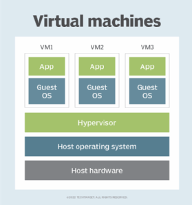
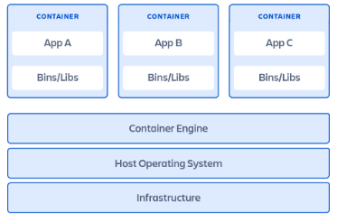

Virtual machines or containers: which one's right for you? Let's break it down and make your choice crystal clear. In this blog, we'll be talking and comparing both of them in detail.

So, first of all, what do we mean when we say virtual machines(VM) and containers?

**"A virtual machine is a compute that use software instead of physical to run programs and deploy apps."**

**"A container is a standard unit of software that packages up code and all its dependencies so the application runs quickly and reliably from one computing environment to another."**

Now you all be thinking what the hell am I talking about? So let me explain it.

In simple terms,

A virtual machine is like a new operating system that we can run on our computer without removing our previous OS. It requires the disk space, CPU, and many more things. As shown in the below image.

Now talking about the conatiners.

So containers are basically, in comparison to a virtual machine, like a lightweight, self-contained application that can run on your computer without the need for a separate operating system.

This means they do not require the extra disk space and CPU memory as virtual machines. Which makes them more portable and compatible to use.

The below image will clear the above statement.

So we can see that the container doesn't require any "Guest OS" to run, they can run on the host OS itself.

Now talking about both of them in detail.

## Virtual Machines (VM)

1. A virtual machine is a compute that uses software instead of physical to rn programs and deploy apps.

2. VMs are heavier in terms of resource consumption. They require a complete OS, including the kernel, which can result in significant resource overhead.

3. VMs are less portable due to their larger size and the need for specific virtualization software to run. Moving VMs between different environments can be more complex.

4. VMs have a longer boot time because they need to boot a full OS. As they have huge size.

5. VMs are often considered more secure due to their stronger isolation, but this also comes with a larger attack surface.

6. VMs are suitable for running multiple operating systems on a single physical server, supporting legacy applications, and providing strong isolation between workloads.

7. Some Examples of Virtual Machines are:- (i) Virtual Box (ii) Hyper-V

## Containers

1. A container is a standard unit of software that packages up code and all its dependencies so the application runs quickly and reliably from one computing environment to another.

2. Containers are lightweight and have lower resource overhead. Since they share the host OS kernel, they only require the necessary libraries and binaries for the specific application they run.

3. Containers are highly portable. They package the application and its dependencies together, making it easier to run the same container on different systems that support containerization.

4. Containers have faster startup times as they don't need to boot an entire OS; they can start almost instantly.

5. Containers can be rapidly scaled up or down, making them ideal for microservices and applications with varying workloads.

6. Containers provide a lighter form of isolation, which can be a security concern in multi-tenant environments. However, good container security practices can mitigate these risks.

7. Containers excel in deploying and managing microservices, modern cloud-native applications, and environments where quick scaling and portability are essential.

8. Some Examples of Containers are:- (i) PhotonOS

By this time, I hope you all understand and got the basic idea on what virtual machines and conatiners are, and what are the key difference between them.

Hope you all like this blog. Thanks.
