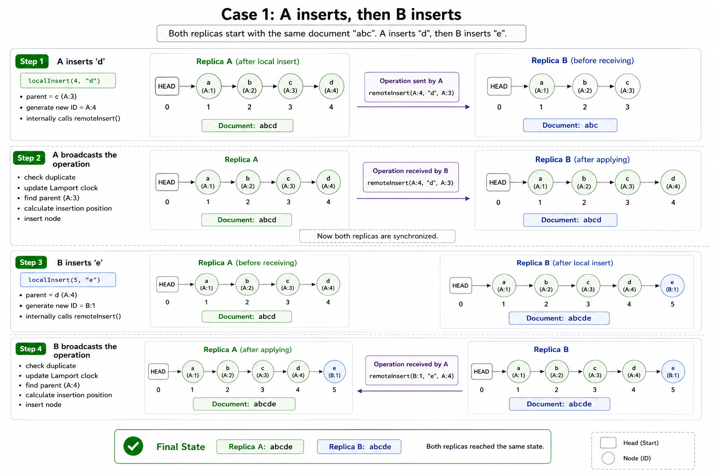
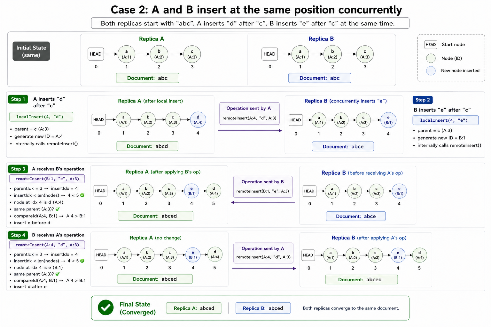
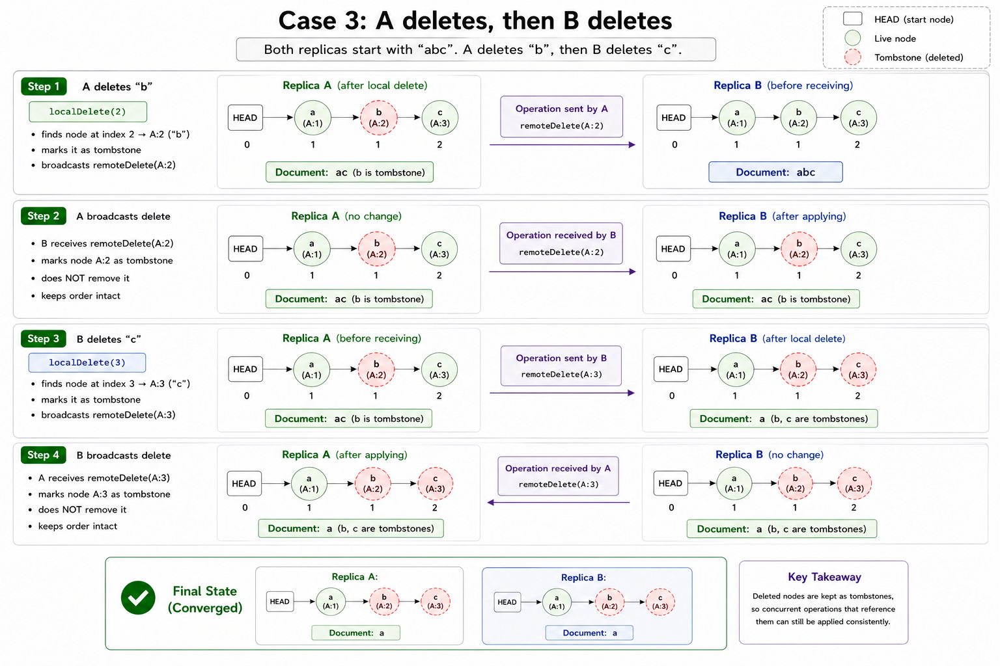

Ever wondered how google docs or any other collaborative editor manage to work consistently and smoothly when concurrent users are making changes at the exact same time? How can a system handle multiple writes to the same position concurrently without crashing or causing anyone to lose their work?

[Conflict-free Replicated Data Type (CRDT)](https://en.wikipedia.org/wiki/Conflict-free_replicated_data_type) is a special kind of data structure that merge different states of work, resolve the conflicts and **guarantee that every concurrent user eventually reach the same state** without the need of manual conflict resolution.

## Why do we even need CRDT?
CRDT is the core of today's collaborative editors. But why you even need CRDT?
Let's say you(A) and you're friend(B) are working on a same google doc.
```text
A writes "hey" → went to server → saved in db
B writes "hi" → went to server → saved in db
```

Imagine a really common scenario where you both are writing at the same time 
```text
A is writing "hello"
B is writing "bye"
```

both the states reached the server and now there are conflicts
- which state to save in db?
- if saving both should A state comes first or B? 

Similarly there are many scenarios, like A is writing and B is deleting at the same time or A and B both are deleting and many more. How do you solve this? You need something that solves these conflicts without any loss of work or inconsistent states for every user. 

Here comes CRDT that resolves these conflicts for you and guarantee every user reach the same consistent state of work. There are 2 types of CRDT

1. **State-based CRDT (CvRDT):** Complete local state of each user (replica) are shared between each other.
2. **Operation-based CRDT (CmRDT):** Replica broadcast or share only the operations instead of complete state.

CRDT ensures 3 properties:
- **commutative:** a + b = b + a
- **associative:** a + (b + c) = (a + b) + c
- **idempotency:** no duplicates

Both have their own data structure and algorithm with various pros and cons. 
One of the operation-based CRDT's is RGA, that you're going to see in the next section.

## RGA
Replicated Growable Array (RGA) is an operation-based CRDT for ordered sequences, such as text in collaborative editors.
Instead of simply storing complete strings or arrays, RGA assigns every character a globally unique ID. 
When a new character is inserted it doesn't store its position instead it stores the reference of the character after which it was inserted i.e. its parent.

### Structure of the RGA Node
There's always a special `HEAD` node in an RGA. It doesn't store any character instead, it acts as the starting point of the document. The very first inserted character references the **HEAD** node as its parent.

A minimal RGA node contains the following properties.
```text
Node {
  id: UUID,
  character: string,
  parent: UUID | null,
  tombstone: boolean
}
```
1. **ID** – It's a globally unique identifier assigned to each node while insertion. 
2. **character** – The actual character stored in this node.
3. **parent** – The ID of the character after which this node was inserted. The very first node points to a special `HEAD` node (or `null`, depending on the implementation).
4. **tombstone** – A boolean flag used to mark a node as deleted. Instead of physically removing a node, RGA simply marks it as `true`. When rendering the final document, nodes marked as `tombstone = true` are skipped.

```text
HEAD
  │
  ▼
H(id=1)
  │
  ▼
e(id=2)
  │
  ▼
y(id=3)
```

RGA make use of [lamport clock](https://en.wikipedia.org/wiki/Lamport_timestamp), in simple terms it is a global clock that keep systems in sync. 

Every RGA has some fundamental functions. I'll walk you through each function try to make you understand how RGA works internally. 

### Lamport Clock
```js
class IDGenerator {
    private counter = 0;

    constructor(private replica: string) { }

    next(): ID {
        return {
            replica: this.replica,
            seq: ++this.counter,
        };
    }

    update(remoteSeq: number) {
        this.counter = Math.max(this.counter, remoteSeq);
    }
}
```

### `localInsert()`
Whenever a user types something, it is first stored locally using this function. This takes 2 arguments, the index at which you want to insert and the character you want to insert. 

In the code you'll notice, it internally calls `remoteInsert()`, I'll come to that function also later in the section. 

```js
localInsert(index: number, character: string): Node {

    // it finds the parent node 
    const parentNode = index > 0 ? this.findVisibleNode(index - 1) : this.head();
    
    const nextId = this.idGenerator.next(); // generates a new ID for the new node.
    return this.remoteInsert(nextId, character, parentNode.id);
}
```


### `remoteInsert()`
This function basically handles the merging and conflict resolving task for the connected users/replicas and guarantee to generate a deterministic and constant state for each of them 

It is the most important and most confusing function amongst all. But no need to worry I'll show the complete flow of insertion and deletion with different cases soon in this blog. 


```js
remoteInsert(id: ID, character: string, parentID: ID) {
    // check idempotent
    const dupNode = this.findById(id);
    if (dupNode) return dupNode

    this.idGenerator.update(id.seq)

    // find place to insert, but before that create a node
    const node = new Node(id, character, parentID);
    const parentIdx = this.nodes.findIndex(n => n.id.replica === parentID.replica && n.id.seq === parentID.seq);
    if (parentIdx == -1) return node;

    const isChildOf = (a: ID | null, b: ID): boolean => !!a && a.replica === b.replica && a.seq === b.seq;

    let insertIdx = parentIdx + 1;
    while (insertIdx < this.nodes.length) {
        const neighbor = this.nodes[insertIdx];

        if (!neighbor) break;

        // Walk up from `neighbor` to whichever ancestor is a *direct*
        // child of parentID (a true sibling of the node being
        // inserted). Without this, a neighbor that is actually a
        // grandchild of a sibling would get compared as if it were a
        // sibling itself, which breaks a whole subtree out of order and
        // makes insertion order-dependent (not commutative).
        let sibling = neighbor;
        while (!isChildOf(sibling.parent, parentID)) {
            const next = sibling.parent ? this.findById(sibling.parent) : undefined;
            if (!next) break;
            sibling = next;
        }

        if (!isChildOf(sibling.parent, parentID)) {
            break; // left parentID's subtree entirely
        }

        if (this.compareIds(node.id, sibling.id)) {
            break; // new node wins, insert before this sibling's whole subtree
        }

        insertIdx++; // sibling wins, keep skipping past its subtree
    }

    this.nodes.splice(insertIdx, 0, node);
    return node;

}

```

### `localDelete()`
```js
localDelete(index: number): ID | null {
      const targetNode = this.findVisibleNode(index);
      if (targetNode.id.replica === "HEAD") return null; // nothing to delete
      targetNode.tombstone = true;
      return targetNode.id;
  }
```


### `remoteDelete()`
```js
remoteDelete(id: ID): void {
       const node = this.findById(id);
       if (node && !node.tombstone) node.tombstone = true;
   }
```


The basic architecture and application is, 2 user are connected via websockets A and B.
- A types -> localInsert() -> remoteInsert(A operation on A state)
- B types -> localInsert() -> remoteInsert(B operation on B state)
- A operation reaches B -> remoteInsert(A operation on B state)
- B operation reaches A -> remoteInsert(B operation on A state)

Now here you may change the order, but the end result would be exactly same ensuring the first 2 properties of any CRDT i.e. commutative and associative.

Using these functions let's do a dry run on different cases. 

### Case 1: A inserts, then B inserts



Let's assume there are two users, **A** and **B**.

The original document is

```text
abc
```

Since user **A** initially created the document, the nodes are stored as

```text
Idx     ID      Character
0       HEAD    ""
1       A_1     a
2       A_2     b
3       A_3     c
```

User **A** types first.

```text
User A types → d
```

---

### User A inserts `d`

```js
localInsert(4, "d")
```

```js
// Finds parent = A_3 ("c")
// Generates ID = A_4
// Calls remoteInsert(A_4, "d", A_3)
```

Inside `remoteInsert()`

```js
parentIdx = 3
insertIdx = 4

insertIdx < nodes.length
4 < 4 = false
```

Since there are no nodes after the parent, the node is inserted immediately.

Current state of User A

```text
Idx     ID      Character
0       HEAD    ""
1       A_1     a
2       A_2     b
3       A_3     c
4       A_4     d
```

Document

```text
abcd
```

---

### User A broadcasts the operation

The following operation is sent to every connected replica.

```js
remoteInsert(A_4, "d", A_3)
```

User **B** receives the operation.

Inside `remoteInsert()`

```js
// Duplicate check

parentIdx = 3
insertIdx = 4

insertIdx < nodes.length
4 < 4 = false
```

The node is inserted.

Current state of User B

```text
Idx     ID      Character
0       HEAD    ""
1       A_1     a
2       A_2     b
3       A_3     c
4       A_4     d
```

Document

```text
abcd
```

Now both replicas are synchronized.

```text
User A → abcd
User B → abcd
```

---

### User B now inserts `e`

After receiving A's operation, User **B** types `e`.

```js
localInsert(5, "e")
```

```js
// Finds parent = A_4 ("d")
// Generates ID = B_1
// Calls remoteInsert(B_1, "e", A_4)
```

Inside `remoteInsert()`

```js
parentIdx = 4
insertIdx = 5

insertIdx < nodes.length
5 < 5 = false
```

Since there are no nodes after the parent, the node is inserted immediately.

Current state of User B

```text
Idx     ID      Character
0       HEAD    ""
1       A_1     a
2       A_2     b
3       A_3     c
4       A_4     d
5       B_1     e
```

Document

```text
abcde
```

---

### User B broadcasts the operation

The following operation is sent to User A.

```js
remoteInsert(B_1, "e", A_4)
```

User **A** receives the operation.

Inside `remoteInsert()`

```js
// Duplicate check

parentIdx = 4
insertIdx = 5

insertIdx < nodes.length
5 < 5 = false
```

The node is inserted.

Current state of User A

```text
Idx     ID      Character
0       HEAD    ""
1       A_1     a
2       A_2     b
3       A_3     c
4       A_4     d
5       B_1     e
```

Document

```text
abcde
```

---

### Final State

```text
User A → abcde
User B → abcde
```

Since the operations happened one after another instead of concurrently, there were no conflicts to resolve. Every replica simply replayed the same operations in the same order, resulting in the same final state.


### Case 2: Two users insert at the same position concurrently



Let's assume there are two users, **A** and **B**.

The original document is

```text
abc
```

Since user **A** initially created the document, the nodes are stored as

```text
Idx     ID      Character
0       HEAD    ""
1       A_1     a
2       A_2     b
3       A_3     c
```

Now both users type at the exact same position.

```text
User A types → d
User B types → e
```

---

### User A inserts `d`

```js
localInsert(4, "d")
```

```js
// Finds parent = A_3 ("c")
// Generates ID = A_4
// Calls remoteInsert(A_4, "d", A_3)
```

Inside `remoteInsert()`

```js
parentIdx = 3
insertIdx = 4

insertIdx < nodes.length
4 < 4 = false
```

Since there are no nodes after the parent, the node is simply inserted.

Current state of User A

```text
Idx     ID      Character
0       HEAD    ""
1       A_1     a
2       A_2     b
3       A_3     c
4       A_4     d
```

Document

```text
abcd
```

---

### User B inserts `e`

At exactly the same time, User B performs

```js
localInsert(4, "e")
```

```js
// Finds parent = A_3 ("c")
// Generates ID = B_1
// Calls remoteInsert(B_1, "e", A_3)
```

Inside `remoteInsert()`

```js
parentIdx = 3
insertIdx = 4

insertIdx < nodes.length
4 < 4 = false
```

Again, there are no nodes after the parent, so it is inserted immediately.

Current state of User B

```text
Idx     ID      Character
0       HEAD    ""
1       A_1     a
2       A_2     b
3       A_3     c
4       B_1     e
```

Document

```text
abce
```

At this point, both replicas have diverged.

```text
User A → abcd
User B → abce
```

---

### Operations are exchanged

The operations are now exchanged through WebSockets.

```text
User A receives

remoteInsert(B_1, "e", A_3)

User B receives

remoteInsert(A_4, "d", A_3)
```

---

### User A receives User B's operation

Current document

```text
abcd
```

Operation

```js
remoteInsert(B_1, "e", A_3)
```

Inside `remoteInsert()`

```js
// Duplicate check

parentIdx = 3
insertIdx = 4

insertIdx < nodes.length
4 < 5 = true
```

The current node at index 4 is

```text
A_4 ("d")
```

We first check whether it is a direct child of the parent (`A_3`).

```text
A_4.parent == A_3

✓ Direct child
```

Now both nodes are siblings, so we compare their IDs.

```js
compareId(A_4, B_1)
```

Since

```text
A_4.seq = 4
B_1.seq = 1

4 > 1
```

`B_1` wins and should be inserted before `A_4`.

Final node order becomes

```text
Idx     ID      Character
0       HEAD    ""
1       A_1     a
2       A_2     b
3       A_3     c
4       B_1     e
5       A_4     d
```

Document

```text
abced
```

---

### User B receives User A's operation

Current document

```text
abce
```

Operation

```js
remoteInsert(A_4, "d", A_3)
```

Inside `remoteInsert()`

```js
// Duplicate check

parentIdx = 3
insertIdx = 4

insertIdx < nodes.length
4 < 5 = true
```

The current node at index 4 is

```text
B_1 ("e")
```

Again, both nodes are direct children of `A_3`.

```js
compareId(A_4, B_1)
```

```text
A_4.seq = 4
B_1.seq = 1

4 > 1
```

Since `B_1` should come before `A_4`, `A_4` is inserted after `B_1`.

Final node order becomes

```text
Idx     ID      Character
0       HEAD    ""
1       A_1     a
2       A_2     b
3       A_3     c
4       B_1     e
5       A_4     d
```

Document

```text
abced
```

---

### Final State

```text
User A → abced
User B → abced
```

Even though both users inserted different characters at the exact same position and received the operations in different orders, both replicas converged to the same final state. This deterministic ordering is what makes RGA conflict-free.


### Case 3: A deletes while B inserts concurrently



Let's assume both replicas start with the same document.

```text
Document = "abc"

HEAD
 │
 ▼
a(id=A:1) → b(id=A:2) → c(id=A:3)
```

Replica A

```text
abc
```

Replica B

```text
abc
```

Now both users make changes at the same time.

```text
User A deletes → c
User B inserts → d after c
```

---

### Step 1: A deletes `c`

A deletes the last character.

```js
localDelete(3)
```

```js
// finds the visible node at index 3
// target = A:3 ("c")
// marks the node as a tombstone
```

Inside `localDelete()`:

```js
targetNode = A:3

targetNode.tombstone = true
```

The node is **not physically removed**.

Replica A now looks like:

```text
HEAD
 │
 ▼
a → b → c(tombstone)
```

Since tombstone nodes are skipped while rendering:

```text
Document = "ab"
```

Replica B is still:

```text
a → b → c

Document = "abc"
```

A broadcasts the delete operation:

```js
remoteDelete(A:3)
```

But B hasn't received it yet.

---

### Step 2: B inserts `d`

At the same time, B inserts `d` after `c`.

```js
localInsert(4, "d")
```

```js
// parent = A:3 ("c")
// generate new ID = B:1
// internally calls remoteInsert()
```

B's local state still contains `c`, because it hasn't received A's delete operation yet.

Inside `remoteInsert()`:

```js
parentIdx = 3
insertIdx = 4

insertIdx < nodes.length
4 < 4 = false
```

So `d` is inserted after `c`.

Replica B becomes:

```text
HEAD
 │
 ▼
a → b → c → d
```

Document:

```text
abcd
```

At this point:

```text
Replica A = ab
Replica B = abcd
```

---

### Step 3: A receives B's insert operation

A now receives:

```js
remoteInsert(B:1, "d", A:3)
```

A's current state is:

```text
a → b → c(tombstone)
```

Inside `remoteInsert()`:

```js
parentIdx = 3
insertIdx = 4

insertIdx < nodes.length
4 < 4 = false
```

Even though `c` is a tombstone, the node still exists in the internal structure.

Therefore, `d` can still reference `c` as its parent.

Replica A becomes:

```text
HEAD
 │
 ▼
a → b → c(tombstone) → d
```

When rendering the document, the tombstone is skipped.

```text
Document = "abd"
```

---

### Step 4: B receives A's delete operation

B now receives:

```js
remoteDelete(A:3)
```

Inside `remoteDelete()`:

```js
const node = this.findById(A:3)

node.tombstone = true
```

The node is not removed.

Replica B becomes:

```text
HEAD
 │
 ▼
a → b → c(tombstone) → d
```

When rendering:

```text
Document = "abd"
```

---

### Final State

```text
Replica A = abd
Replica B = abd
```

Both replicas eventually converge to the same state.

The important part here is that **`c` was never physically removed**.

```text
a → b → c(tombstone) → d
```

The `c` node is still part of the internal RGA structure, which means `d` can continue to reference it even after `c` has been deleted.

This is one of the reasons RGA uses **tombstones**. A node can be logically deleted from the document while still remaining in the underlying data structure so that concurrent operations referencing that node can be handled correctly.

```text
A deletes c
        ↓
c becomes tombstone
        ↓
B concurrently inserts d after c
        ↓
Both operations are exchanged
        ↓
c remains internally, but is not rendered
        ↓
Final document = "abd"
```


You can get the source code from [here](https://github.com/Muhammad-Owais-Warsi/crdt) and try running the application locally to see it in action. In [README.md](https://github.com/Muhammad-Owais-Warsi/crdt/blob/main/readme.md) you can get some more information on this. 

## Conclusion
CRDTs solve one of the hardest problems in collaborative editing, handling concurrent changes without losing data or creating inconsistent states. RGA does this by giving each operation a deterministic way to merge with others, allowing every replica to eventually reach the same state.
