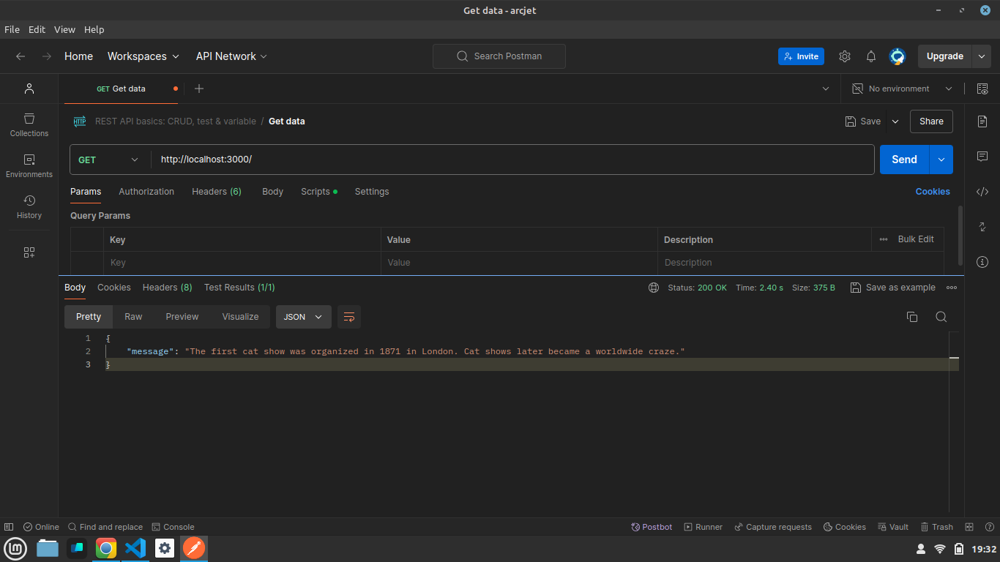
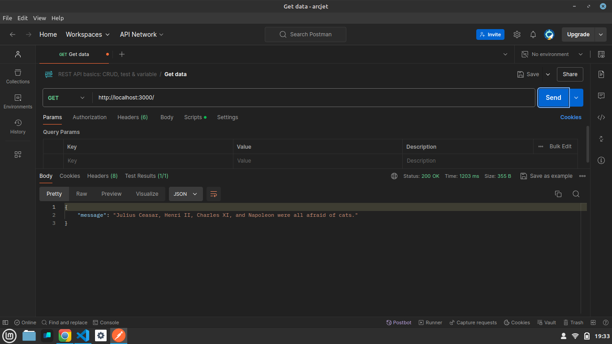
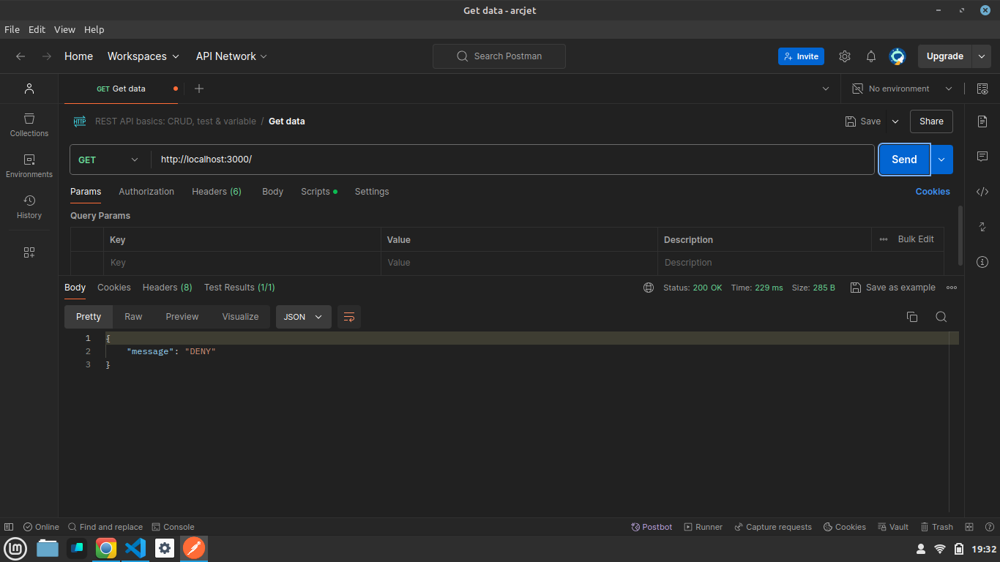

Hey, everyone in today’s blog we’ll be talking about [Arcjet](https://arcjet.com/). A security tool that helps developers protect their apps against bot attacks, data redaction , helps implementing rate limiting, email validation in our apps and much more. It’s a, “developer-first approach to security”.

In the below sections, we’ll be integrating Arcjet in our node-express application and will be implementing a simple rate limiting into our application.

Let’s start 🚀🚀

## Initializing the Project

```bash
npm init -y
```

This will initialize your simple node project , now let’s required install the dependencies.

## Installing the Dependencies

```bash
npm i express cors nodemon dotenv
```

Also create a `index.js` and `.env` file in your root directory.

Now, in your `.env` file add your API KEYS for the Arcjet project.

Your `.env` should be somewhat as shown below

```bash
ARCJET_KEY =
ARCJET_ENV = development
PORT =
```

## Writing the Code

We’ll start by importing the required dependencies and the modules in our `index.js` file.

```js
import express from "express";
import cors from "cors";
import axios from "axios";
import dotenv from "dotenv";
dotenv.config();
```

Your initial project is somewhat will look like as below.

```js
import express from "express";
import cors from "cors";
import axios from "axios";
import dotenv from "dotenv";
dotenv.config();

const PORT = process.env.PORT;
const app = express();
app.use(cors());
app.use(express.json());

app.get("/", (req, res) => {});

app.listen(PORT, () => {
    console.log(`Server running on http://localhost:${PORT}`);
});
```

## Instantiating Arcjet

Now we’ll be creating Arcjet instance to implement rate limiting. So we will import `arcjet` along with `tockenBucket` about which I’ll talk further in this blog.

```js
import arcjet, { tokenBucket } from "@arcjet/node";
```

```js
// Initialising Arcjet
const aj = arcjet({
    key: process.env.ARCJET_KEY,
    characteristics: ["ip.src"], // Track request by IP
    rules: [
        tokenBucket({
            mode: "LIVE",
            refillRate: 5, // Refill 5 tokens per interval
            interval: 10, // Refill every 10 seconds
            capacity: 10, // Bucket capacity of 10 tokens
        }),
    ],
});
```

Now we’ll implement a `get` route and will call a free API and will implement rate limit on that. Each and every term used above is explained at the last of the blog.

```js
app.get("/", async (req, res) => {
    const decision = await aj.protect(req, { requested: 5 }); // deduct 5 tokens from the bucket
    console.log(decision);

    if (decision.isDenied()) {
        res.json({ message: decision.conclusion });
    } else {
        const response = await axios.get("https://catfact.ninja/fact");

        res.json({ message: response.data.fact });
    }
});
```

So finally the code finishes here 🥳.

## Testing

We’ll use **postman** to test our application.

1. First request . It returns data fetched from the API
   

2. Second request. It again fetch us the data.
   

3. Third request. It denied to hit the endpoint.
   

## Understanding the Terms

Understanding each term used while instantiating Arcjet.

```js
const aj = arcjet({
    key: process.env.ARCJET_KEY,
    characteristics: ["ip.src"], // Track request by IP
    rules: [
        tokenBucket({
            mode: "LIVE",
            refillRate: 5, // Refill 5 tokens per interval
            interval: 10, // Refill every 10 seconds
            capacity: 10, // Bucket capacity of 10 tokens
        }),
    ],
});
```

1. **key:** It’s your Arcjet `API_KEY`.

2. **characterstics:** It defines on what basis Arcjet will track the request of the user hitting the enpoints. Arcjet let developers use different types of characterstics.
   Read here: https://docs.arcjet.com/rate-limiting/quick-start

3. **rules:** They defines the protection we are using in our application. Check out this example to understand various types of rules: https://docs.arcjet.com/get-started?f=node-js-express

4. **tockenBucket:** It is a rate limiting algorithm. Arcjet provide with various different types of rate limiting algorithms such as `sliding window` etc. Read here: https://docs.arcjet.com/rate-limiting/algorithms
    1. **refillRate:** Rate at which the tokens will be refilled in the bucket.

    2. **interval:** It defines the time after the bucket will start refilling.

    3. **capacity:** Maximum capacity of the bucket or the maximum tokens it can carry.

5. **requested:** It is the number of tokens deducted from the bucket after each request.

## Conclusion

In this blog we implemented a simple node-express application with rate limiting using Arcjet.

If you found this blog helpful, share it with others who might benefit.

Want to know more about Arcjet?

Check this out: https://arcjet.com/

Thanks for reading :)
