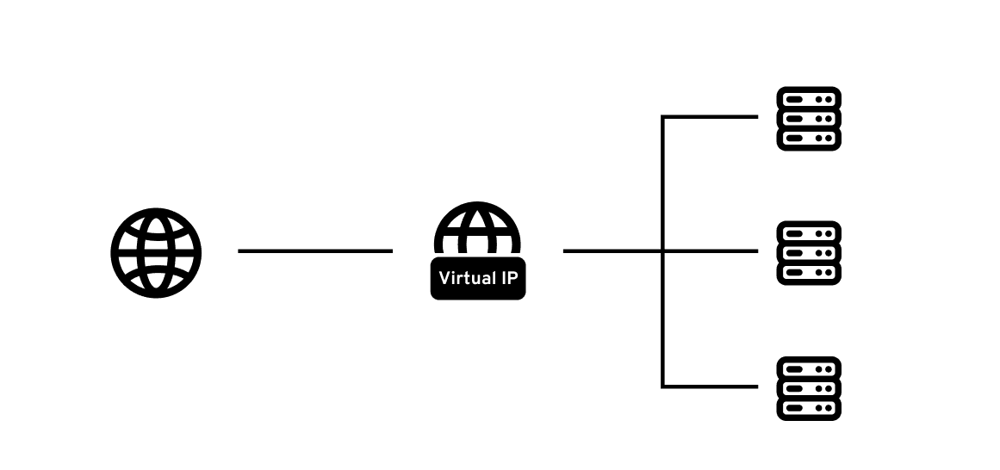

As we all know in production companies manage multiple database instances or nodes in order to handle a tremendous amount of load on their servers. A plenty of tools and algorithims has been developed till date to handle the traffic coming onto the databases seamlessly. But along with building solutions, how we're going handle the failovers gracefully needs to be kept in mind.

**What happens when a database instance crashes out?** Ignoring all the technalities if we simply think, the answer to this is to **"use the other instances of the database until the failed one gets fixed."** and to the suprise this is what companies in the production do when their database instance crash out due to some reason.

**But how?**

## Case Study

A company has 2 database instances, one of them is the **master node** that serve most of the traffic and the other one is the **standby node**, to serve the read traffic and to take over in case of a failover. Each instance of the database has it's own IP address to communicate with. The server is currently connected to master node to handle all the database transactions.

Suddenly due to some anomaly, the **master node starts failing and it results in a crash**. The standby node should come and takeover to handle the incoming traffic as soon as possible. To make the standby node actively handle the load, the company must **re-route the traffic from the master to the standby node.** To do so a person has to manually change the IP we're currently conected to change and connect to the standby node IP.

Doing this will take hell lot of a time to ignite up the things, and until then the incoming requests keeps on failing. The company needs a **solution where they see almost no downtime even though one of their database instance has just crashed.**

## Virtual IP Address (VIP)

Instead of connecting to individual IP addresses of the database instances, why not treat them as a single service that consists 2 instances of the database. **Now this service as a whole has it's own IP that we can call as a Virtual IP Address (VIP)**.

**"VIP is an IP address assigned to multiple applications or physical servers rather than a single device or network interface."**



## Virtual Router Redundancy Protocol (VRRP)

**VRRP is a protocol that allows multiple machines to share IP address (VIP), so that if one machines fails, another one can take over automatically ensuring [High availability (HA)](https://www.scylladb.com/glossary/high-availability-database/) is mantained.**

VRRP ensures that this VIP is always owned by an active and reachable node. It is important to note that VRRP does not perform database failover, it's primary responsibility is to maintain service reachability with minimal downtime by dynamically managing the assignment of the VIP between nodes.

### Working of VRRP

Each instance/node of a database is assigned with a **priority**. Node with highest priority is the **master node** and other are **standby node**. VIP is owned by the active master node. The master keep sending a **VRRP advertisements** after a set interval, to ensure that it's still alive and active. If at any instance the master node crashes the **master down interval** starts, if within this time period the network didn't receive any advertisement, it is confirmed that the master node is crashed and no longer serving the traffic, and the standby node with the highest priority has to takeover to serve the incoming requests.

```cpp
struct Node {
    std::string name;
    int priority;
    bool alive;
};

int main() {
    std::vector<Node> nodes = {
        {"Node-A", 150, true},
        {"Node-B", 120, true}
    };

    int masterIndex = 0;

    for (int t = 1; t <= 8; t++) {
        std::this_thread::sleep_for(std::chrono::seconds(1)); // send advertisements after the interval of 1 sec.

        if (t == 4) {
            nodes[masterIndex].alive = false; // master node crashes here.
        }

        if (nodes[masterIndex].alive) {
           send_advertisement();
        } else {
            // no master exist, elect new one based on the priority.

            int newMaster = -1;
            int bestPriority = -1;

            for (int i = 0; i < nodes.size(); i++) {
                if (nodes[i].alive && nodes[i].priority > bestPriority) {
                    bestPriority = nodes[i].priority;
                    newMaster = i;
                }
            }

            if (newMaster != -1) {
                masterIndex = newMaster; // new master is elected.
            }
        }
    }
}
```

The above setup runs for a total of 8 seconds. After each second the master node sends advertisement over the network, indicating that it is operational. After the 4th second, the master failes and the standby node with highest priority takes over.

## Keepalived

[Keepalived](https://keepalived.readthedocs.io/en/latest/introduction.html) is a linux daemon designed for high availability (HA) and load balancing using VRRP (Virtual Router Redundancy Protocol) to manage VIP (Virtual IP Address).

It manages VRRP advertisements, monitor node health, and dynamically assigns or remove the VIP during failover events. This allows system to mantain high availability and ensure minimal downtime.

A basic keepalived configuration may look like

```bash
vrrp_instance VI_1 {
    state MASTER
    interface eth0
    virtual_router_id 51
    priority 150

    virtual_ipaddress {
        10.0.0.100
    }
}
```

Through such configuration, the node with the highest priority becomes the active owner of the Virtual IP, while other nodes remain on standby. If the active node fails, Keepalived ensures that another node automatically takes ownership of the Virtual IP, allowing traffic to continue flowing without manual intervention.

## Conclusion

Modern production systems are designed with the assumption that failures will eventually occur. Mechanisms like Virtual IP failover enable services to remain reachable even when individual machines become unavailable.

From an application’s perspective, communication continues with the same endpoint, while the underlying infrastructure transparently handles role transitions and traffic redirection. This layered approach to availability is one of the key reasons why large-scale systems are able to deliver reliable infrastructure and maintain high availability throughout.
