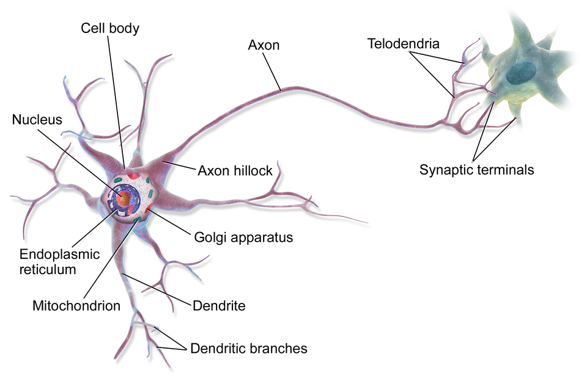
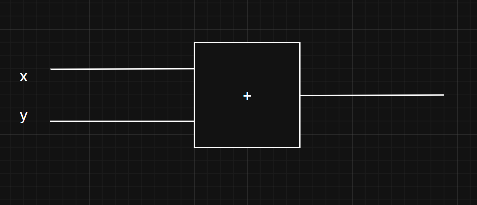

From gemini to claude, if we break these AI models to their core we find a **massive mesh of interconnected nodes constantly passing some numbers to one another**. This system is called neural network, the brain behind most of the modern AI models.

**But what actually are neural network?**

In simple terms, it is a collection of interconnected nodes know as neurons. Each neuron carry some numerical value known as **weights** and **biases**, which determines how the information will flow through the net.

When an input is given, it passes through these neuerons. Each neuron perform some calculations, transform the values and send it forward for further processing.

At the end, the network compares the calculated result with the actual one. If it's wrong, it goes back and perform the whole calculation again but this time, it slightly tweaks **weights** and **biases** in a direction that produces the closer result. **This process repeats thousands and millions time and finally our system will gradually learn.**

_This resemble our human brain, which contains millions of neurons connected to each other. We get some input from the environment, process it in our brain and perform the action. If it's wrong we go back tweak our deciding factors and make decisions again and so on..._



<p align="center">
    <em>Source: Wikipedia (Single neuron of a human brain)</em>
</p>

Even though the maths used here is really simple, but understanding the "why?" behind it, can really boggles up your mind.

## Single neuron

You can think of a single neuron as a node carrying some value. To produce the result this single nueron has to perform calculation and hence required an operand i.e an another neuron.



To produce the result they have to perform the `multiplication` operation. Hence, they did nothing but move forward with some new value.

```py
def multiply(x,y):
    return x * y

multiply(2,3)
```

**But here we have to understand our goal, which is not only moving forward but at the same time get the correct answer.**

Let's take an example: We want the result to be 7. Performing the operation with the input values as x and y what we get? `2 * 3 = 6`. Comparing we can see the huge difference betweent the actual output and the calculated output.

**Therefore we have to think how to reach closer to the output as much as possible? How much we change the values to get the closer result? In what direction should we change the values to get the closer result?**

## First Intution

The first intution that comes to everyone's mind is, **why not just change the values of `x` and `y` slightly with some fixed random magnitude and keep comparing with the result, as soon we get the closest result or maybe after some time/iterations we stop.**

It would something look like

```py
def process(x, y, mag):
    best = float("-inf")
    best_x, best_y = x, y

    for _ in range(100):
        # small random tweaks
        new_x = x + mag * (random.random() * 2 - 1)
        new_y = y + mag * (random.random() * 2 - 1)

        out = new_x * new_y

        if out > best:
            best = out
            best_x, best_y = new_x, new_y

    return best_x, best_y, best


x, y, result = process(-2, 3, 0.01)
```

Now here we have to make a meaningful number of iterations even when the input values are 2. In real production grade neural networks we hundred and thousands of inputs, a lot of layers and not what. If we apply this method in calculating the result there, it would take hundred of years and a lot of compute power.

## Second method: Numerical gradient

The problem in the first approach is not that we can't get the output, but neither us nor the algorithm know what it's doing.

It's like, that you're standing on a mountain slope and your goal is to reach the peak of the mountain. Nowyou're taking random steps, forward and backward and you yourself don't know whether setp I'm going to take is the correct one and would help me to reach my goal.

Now, by observing the previous output i.e **2 \* 3 = 6** and our goal **7**, you have 2 choices. Either increase the magnitude of the inputs or decrease them, based on the observation here, the most suitable one is increasing the value of the inputs by little and compare with the output and check.

```py
x = 2 + 0.001 # suppose we increased the value of x by little
y = 3

c = multiply(x, y)
print(c) # 6.003
```

Here, you can clearly see that on increasing the value of `x` by a little amount, results in increase of the output value. Now we can compare this output with the actual one and get the difference. **The ratio of these differences in the output can be written as a formulae in mathematics — the derivative.**

For a function $f(x)$, the derivative measures how much $f$ changes when we nudge $x$ by a tiny amount:

**The general formulae is:**

$$
f'(x) = \lim_{h \to 0} \frac{f(x + h) - f(x)}{h}
$$

where `h` is the small tweak amount. Now performing our calculation.

```py
x = 2
y = 3

out = multiply(x, y) # 6
h = 0.001

# compute derivative w.r.t x
xph = x + h
out2 = multiply(xph, y) # 6.003
x_derivative = (out2 - out) / h # 3

# compute derivative w.r.t y
yph = y + h
out3 = multiply(x, yph) # 6.002
y_derivative = (out3 - out) / h # 2

```

Now if we apply this derivative on top of the inputs to tweak them, you can see the change clearly. `step_size` (also called **learning rate**) controls how big a step we take in the direction of the gradient — too small and we barely move, too big and we overshoot

```py
step_size = 0.07
out = multiply(x, y)              # before: 6
x = x + step_size * x_derivative  # 2 + 0.07 * 3 = 2.21
y = y + step_size * y_derivative  # 3 + 0.07 * 2 = 3.14
out_new = multiply(x, y)          # 2.21 * 3.14 = 6.94
```

With just one step of gradient ascent, we went from 6 to **6.94** — much closer to our target of 7. In a neural network with millions of parameters, this same idea scales: compute the gradient of the loss with respect to every weight and bias, then nudge them all in the direction that reduces the error.
