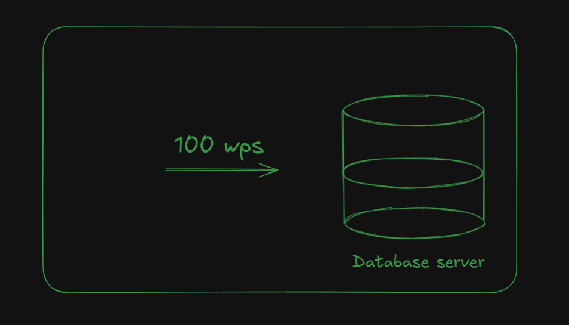
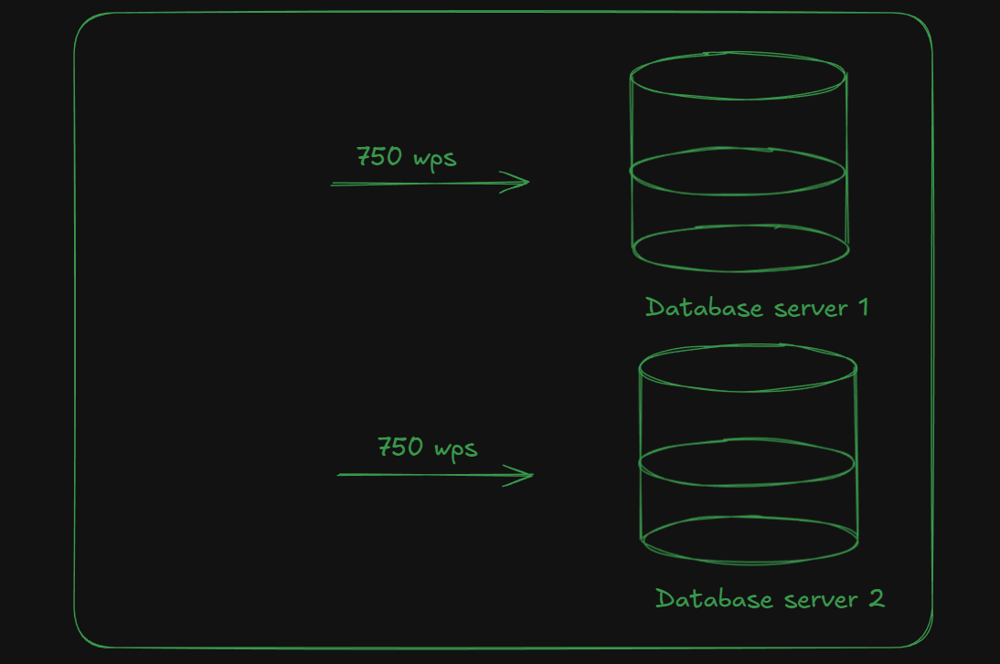

At scale, two of the most commonly used terms database and design are **partitioning and sharding**. As the system grows, organizations eventually need to implement at least one of them to **handle load and traffic.**

Due to a very thin line of difference between them, poeple often confuse them. Lets make this line clearer and understand why and at what point a company needs them.

## Case Study

A startup, **company A** just enter the market and people starting to learn about them. This company initially operates on **one database server**, all the reads and writes are on that primary database server. Initially they are getting **100 wps (writes per second)**.

After a few months they notice that traffic has grown. **Instead of 100 wps they are now receiving 500 wps**. Queries become slow, users face difficulties using the app and the database **CPU remains at peak usage** most of the time.

To solve this, the company decides to **increase the database capacity** by buying more resources and hence **vertical scale their database server**. After the upgrade, everything is back to normal, and there are no performance spikes in the database.

The product continues to grow, traffic increases further. Now, **instead of 500 wps, they start receiving 1000 wps**. The company purchase the **maximum database resources available** and can handle the growing traffic smoothly.

One day, a content creator mentions the startup and its product, causing a sudden spike in traffic. **Requests become slow, user experience downtimes and latency increases**. At this point, the company has reached the **maximum limit of vertical scaling** and cannot scale further. **Traffic now reaches 1500 wps**.

With no other option and to handle the load, the company buys a **new database server instance** that can also handle 1000 wps and **distributes the requests between the two servers**.

This allows the system to handle requests smoothly without latency or crashes. The company now also has the option to distribute the data between these two database instances.

> If the data is distributed, then we can say that **data is partitioned among the shards.**

Therefore, from the above case study, **partitioning is the distribution of the data either among different database instances or the same instance and operates at the data level.**

We can also keep an exact copy of the data in the new database instance. This is known as a **read replica** which is only used for reads, while the primary database handles all writes and critical reads.

**Sharding, on the other hand, is the distribution of a large database across multiple machines**. These **machines are refered to as shards** and operates at the system level.

After a point where vertical scaling of database is no longer possible, we need to implement sharding. This is why **sharding is also known as horizontal scaling of databases.**

## Conclusion

Why and when do companies feel the need to implement partitioning and sharding.

- Partitioning operates at the data level and involves distributing of data.

- Sharding operates at the system level and involves distributing of database across machines.

I hope this article helps you and makes the concept more clearer. You can also refer to the following ChatGPT blog to **see this in production and how they handle tremendous traffic while relying on single PostgreSQL instance.**

ChatGPT Blog: https://openai.com/index/scaling-postgresql/
