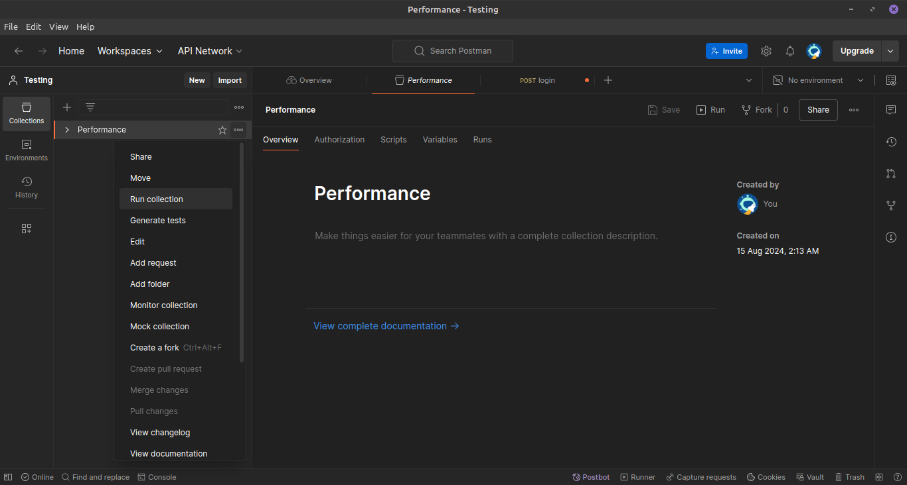
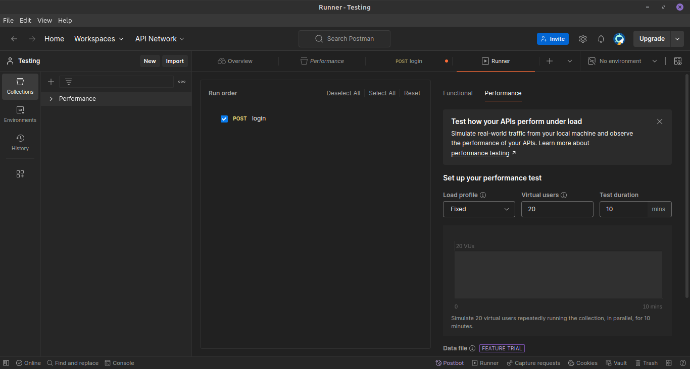

While testing your API , you might wonder how'll my API works under the following circumstances

- When a facing a real-world traffic .

- What will be the response time of my API .

- What will be the error rates .

- etc..

To address the above concerns Postman comes up with an excellent solution for API performance testing, allowing you to test your API endpoints under the real-world traffic condtions.

In today's blog we'll be looking on how to test your API performance using Postman.

## How to use Postman for API Performance testing

You can use Postman's Collection Runner to test your API Performance.

**Step 1 :** Select a collection you want to run test on.

After clicking on "Run Collection" select the endpoints you want to test.

**Step 2 :** Select the performance tab.

After that make the changes according to your need. You can change the number of virtual users ( unique user who will hit your API each second). You can als chnage the test duration.

**Step 3 :** Click on "Run" and observe the performance.

    <iframe
        src="https://www.loom.com/embed/5916d60e0117476bb76a531384f269e8"
        style="top: 0; left: 0; width: 100%; height: 100%; position: absolute; border: 0;"
        allowfullscreen
        scrolling="no"
        allow="encrypted-media *;"
    ></iframe>

You can now observe the real time performance of your API.

You can get to know the average response time , error rates , requests/seconds and much more.

You can even hover onto the lines to know the nature of your errors and debug them. Each and everything is logged into the console.

## Conclusion

In this blog we learnt how to test out API's performance under real world traffic using Postman.

If you found this blog helpful, share it with others who might benefit.

Wants to know more about API testing via Postman?

Check this out https://blog.postman.com/postman-api-performance-testing/

Thanks for reading :)
