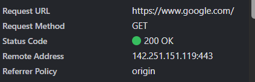
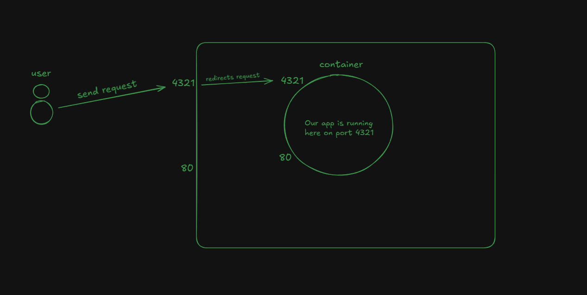
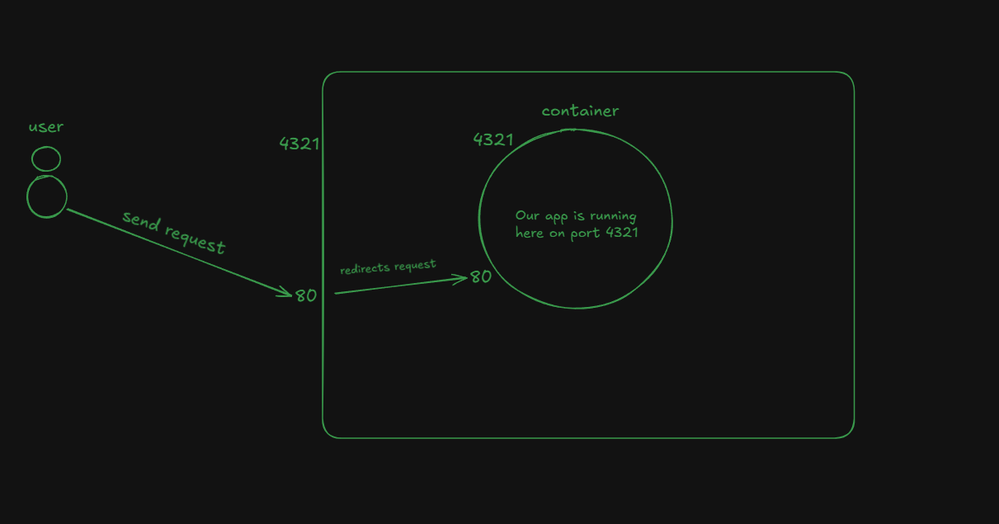
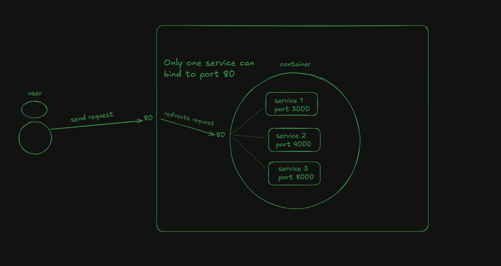
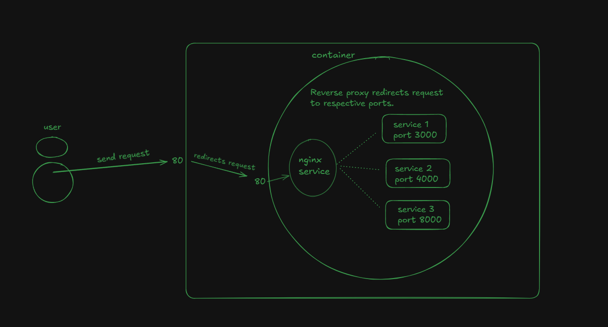
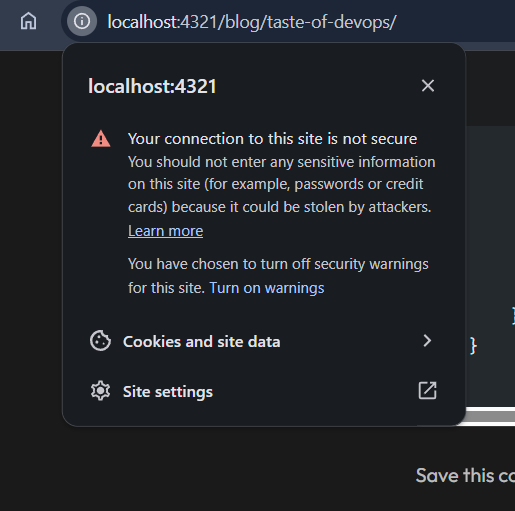
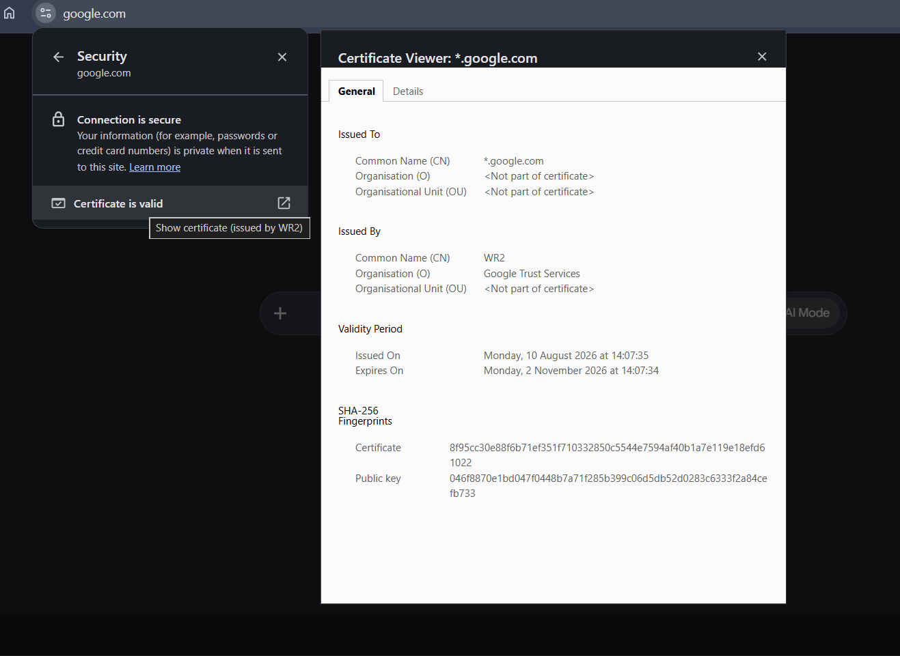

This blog will be giving you the taste of devops, from running an ubuntu machine to running your app on HTTPS, everything will be shown hands-on.
Before starting and jumping into the core technical part, make sure you have [docker](https://www.docker.com/) installed on your machine. 

I'm currently on WSL (if you're on Windows, make sure to have required dependencies installed).

Instead of buying a domain and purchasing a machine we will be utilising docker and simulate the process. The best way to follow this is by doing along with me and keep watching the results side-by-side.

## A brief history
Before the cloud technology,  companies used to go to big org to rent the servers/machines (this includes lots of paperwork and what not) and run their apps on them. After buying the server they used to get the IP for that machine and they just attach their domain to it and it's done. Now the app is available on the internet to surf. 

Cloud computing is introduced, now you don't need to visit these companies instead just get the machines **(basically compute for example: 250 MB of RAM, 1 CPU etc.)** online and also according to your need. After buying they would generally give you the public IP of the machine and now you can use it by attaching the domain and deploy your apps on it. You just need to pay the monthly or yearly rent to them. 
This is what we still do.

There are a number of cloud providers AWS, Google Cloud, Digital Ocean etc..

## Getting an ubuntu machine 
This world runs on linux, to get started we need a machine (Ubuntu, Debian etc.) to work upon.

Let's get started with pulling an ubuntu image on our machine using docker. 
This command will pull the latest docker image on our machine.
```
docker pull ubuntu:latest
```

Now you start a container that runs an ubuntu machine that is built with the help of the image you just pulled.

```
docker run ubuntu:latest
```
But there's an issue, **docker will run the container as long as there is an active process running in it. Ubuntu machine has none. Hence it immediately stopped after getting started.**

**To make it run 24/7 we need to run it in detached mode (run in the background with full control)**. For this you just need the `-d` flag in the command 

```
docker run -d ubuntu:latest
```
Here we can give many other flags as per our use, like `--name <some_name>` to give name to your container 
`-p <machine_port:container_port>` to open/set-up a port for your container.


## SSH (Secure Shell)
**It is a protocol used to access remote computers.** Here you will be performing SSH into your container to get access to and perform various activities.

By default SSH runs on port `22`, hence when creating a container we open up a port that attaches to this specific port for SSH access.


This command will forward any request coming to your machine's port `2222` to  container's port `22`
```
docker run -d -p 2222:22 ubuntu:latest
```

Now the ubuntu machine (container) is up and running with an open port waiting for any request. **This machine has got nothing, not even the SSH, therefore you need to install it. But how?**

You can't enter inside container without SSH, but at the same time you don't have SSH inside container to do so.
What we can do is...**when creating a container we execute a command that installs SSH server inside the container for us.**


`bash -c` helps us to execute shell commands inside a container. 
```
docker run -d -p 2222:22 -p 4321:4321 ubuntu:latest bash -c "apt update && apt install -y openssh-server && echo 'root:123' | chpasswd &
& service ssh start && tail -f /dev/null"
```

This command does the following

- Update packages
- Install SSH server
- Sets the root password to `123`
- Start the SSH server
- `tail -f /dev/null` this is like a loop that runs endlessly so that our container never stops.


You will notice that I've also added another port `-p 4321:4321` in the command, it does nothing but **opens another port that connects my machine 4321 port to container's 4321 port** (just in case if we need to do anything in future). So you can open multiple ports also according to your use case.


Now once everything is set up, we can now try entering our container with the following command 

```
ssh root@localhost -p 2222
```

if you remember `2222` is the same port we used when creating this container, and it is attached to container port `22`, which is SSH default port.

Also the machine (container) is running on our own machine, hence we have used `localhost`.

After running the command, you might face some permission issue, so you can try running the following command.
This gives the SSH required permission it needs for the root user.

"Make sure to insert your container ID or container name". You can find them by running `docker ps` command. 

```
docker exec -it <container_id_or_container_name> bash -c "sed -i 's/#PermitRootLogin prohibit-password/PermitRootLogin yes/' /etc/ssh/sshd_config && se
d -i 's/PermitRootLogin prohibit-password/PermitRootLogin yes/' /etc/ssh/sshd_config && service ssh restart"
```

- `-it` is a flag to open interactive terminal session inside a container.
- `docker exec` is used to execute commands inside container.


Try entering your container again...


## Inside Container
Now we're inside a container, you can try running different linux commands such as `ls`, `cd` etc.
But here we don't get Git (we get it by default in linux machines btw), hence we need to install it. 

I'm also installing `curl` and `unzip` also along with `git` as it is required to run my project. You can install any other if you want. 

- `-y` flag auto approves for the permission to download. 
```
apt update && apt install -y git curl unzip 
```

For the project I'll take one of my repo as an example, clone and run it. If you want you can also try the same.

```
git clone https://github.com/Muhammad-Owais-Warsi/port
cd port
```

This particular project requires bun to run. You can install it from [here](https://bun.com/).

```
bun install
bun dev --host 
```

`--host` using this flag, the bun application will allow requests coming from outside the network.

The server for this application starts at port `4321` and if you remember, when creating a container we have set a port `-p 4321:4321`. 

Therefore if you visit [http://localhost:4321](http://localhost:4321), you'll be able to access the application.


## Problems
It seems everything is done and sorted? But you can't share this url to someone and ask them to visit our site.

**tbh in this demo, we can't make people access our site but at least fix our URL somehow**

If you have noticed, websites have URLs like `https://google.com`, `https://zed.dev/` etc.

On comparing the URL you can see 3 major issues

1. port number is visible, you need to remove it.
2. why it is `http` and not `https`.
3. why localhost (or in some case IP of localhost), there must be a domain name.

In the next sections you will be solving the first 2 issues, for the 3rd one we might need to buy a domain that is not our motive for this simulation.


## Issue 1
How can we remove port from our application? If you try to look closely to these `https` URLs you'll notice that internally they are also hitting some port that isn't visible to you. 


You can check this by going to the network tab of your page by inspecting it. The below photo shows the port `https://google.com` hits when you visit it. 

It is `443`. You can try this on any other website and notice it will be 443 only. 



This confirms that default port of any 
- **HTTPS website is `443`**
- **HTTP website it is `80`**


Our site is currently running on `HTTP` and on port `4321`, and we know that `HTTP` or we can say `localhost` runs by default on port `80`. So even if you type `localhost` on the browser without the port it will open up a page and is a valid address. 

### Current application state



What if instead of serving our site on port `4321` we also start serving it on port `80`? 

Our site URL will automatically transition from

`http://localhost:4321` -> `http://localhost`

**So the solution was really simple and was changing the port to default `HTTP` port.**

> ## You might need this.
>
> Instead of stopping container and re-doing the complete process of setting-up from start. 
> We will utilise `docker commit` command, that creates an image of our current running container with all the 
> deps and configuration. So in future when you need to start the container with same config with some bit of  
> change we reuse the image.
> ```
> docker commit <running_container_name_or_id> <image_name>
>```
> Then you can start the new container with the following command.
> ```
> docker run -d -p 2222:22 -p 80:80 <image_name>
>

When running the command above instead of port 4321 we can bind the container to port 80. Carefully see the `-p` flag.

```
docker run -d -p 2222:22 -p 80:80 ubuntu:latest bash -c "apt update && apt install -y openssh-server && echo 'root:123' | chpasswd &
& service ssh start && tail -f /dev/null"
```


### Application after we change the port to `80`




Now on chrome if you try visiting `http://localhost`, you can access the site. 

**But here comes another issue.** What happens if there are multiple servers inside our container. We can't bind each one of them to port `80` as it can be used by one at a time, and obviously you'll not buy or in this case run another machine just to run another server and bind it port 80.



## Introducing reverse proxy

What if we let our applications/servers running on the port they are and there's another service/system that sits just before our running applications. Its only work is to **intercept the incoming requests, check the domain from which they're from and redirect to the respective ports.** This is called reverse proxy.

There are several reverse proxies available in the market such as [nginx](https://nginx.org/), [caddy](https://caddyserver.com/) etc.. 

Btw these are not only reverse proxies, but are also used in other works.




For this project we will use nginx and make it run on port `80` and make our application run on port `4321`

So we will start by installing nginx on our container machine

```
apt update && apt install -y nginx nano
```

You can start the nginx now 
```
service nginx start
```

Now visit `http://localhost:80`, you'll see nginx default page as it also by default runs on port `80`

After this you need to tell nginx how it works, for that you need to change the configuration file of nginx, that you can find at path `/etc/nginx/nginx.conf`. You'll also be requiring an editor to edit this file so you can install one of your choice nano, vim etc...I've installed nano.

You can paste the following configuration if running my project or else change it accordingly. You can read the nginx conf file in detail from internet. 

Very quickly I'll tell what it does. 

It listens for the incoming requests on port `80`, and check the domain it is coming from. If it is `localhost`, it redirects the request to port `4321` on which our application is running.

```
events {
   worker_connections 768;
   # multi_accept on;
}

http {
   server {
       listen 80;
       server_name localhost;

       location / {
           proxy_pass http://127.0.0.1:4321;
           proxy_http_version 1.1;

           # Support WebSockets & Hot Module Replacement (HMR) for Bun dev server
           proxy_set_header Upgrade $http_upgrade;
           proxy_set_header Connection "upgrade";

           # Forward original client request headers
           proxy_set_header Host $host;
           proxy_set_header X-Real-IP $remote_addr;
           proxy_set_header X-Forwarded-For $proxy_add_x_forwarded_for;
           proxy_set_header X-Forwarded-Proto $scheme;
       }
   }
}
```

Save this config and reload the nginx server.

```
service nginx --reload
```

Visit `http://localhost` again and you'll be able to access the application. But this time the request is redirected by nginx.


**Hence, we have solved our first problem. Let's go...**


## Issue 2
The browser identify our site as not secure. You may check the status yourself from the browser itself as shown below in the photo.



**This is because we're on HTTP and not HTTPS.**

>HTTP (Hypertext Transfer Protocol) is a protocol used by the [WWW](https://en.wikipedia.org/wiki/World_Wide_Web)
>to serve websites/content over the internet.

>HTTPS (Hypertext Transfer Protocol Secure) is a more secure version of HTTP.

If you remember we've already discussed about the default port of `HTTP` and `HTTPS`. Currently the requests coming on port `80` is captured by nginx and redirected to our application running on port `4321`. 


What if instead of port `80` we make our nginx listen to port `443` which is a default port for `HTTPS`. But this is not simple as switching the ports.


Let's visit [https://www.google.com/](https://www.google.com/), check the security status from the URL bar and we will find a section stating "Certificate is valid". Open that and you'll see 




**This is SSL/TLS certificate.** 

SSL (Secure Socket Layer) or TLS (Transport Layer Security) certificate is a small data file installed on your web server. It serves two functions.

- Encryption: It uses cryptography and cryptographic keys to encrypt the data and hence making it secure. 
- Authentication: It verifies the identity of your website so visitors know they are connecting to your actual domain rather than an imposter site.

Read in detail [here](https://aws.amazon.com/compare/the-difference-between-ssl-and-tls/).


> We use TLS in today's time and not SSL, but the industry calls them as SSL certificates out of habit.


So the next step to solve the issue is to generate the certificate for our site and give to nginx, so it can handle all the verification and other process as all the request is handled by nginx before it reaches our actual server.

There are many services paid and unpaid using which you can generate the certificates. I'm gonna use one of them known as `mkcert`.

Install the required packages
```
apt-get update && apt-get install -y mkcert openssl
```

After installing, we will create a `certs` folder inside our `nginx` folder and create a certificate for our `localhost` domain using `mkcert`.

It will automatically update our `nginx.conf` file referencing these certificates.

```
mkdir -p /etc/nginx/certs
cd /etc/nginx/certs
mkcert -install
mkcert localhost 127.0.0.1 ::1
```

We can restart our nginx service again to give it a fresh start
```
service nginx restart
```

Now the last step is to setup  port `443` instead of `80` on our container. For this we commit the container to get the update image and run it again with the updated ports.

```
docker commit <running_container_name_or_id> <image_name>
```

```
docker run -d -p 22:22 -p 443:443 <image_name>
```

Now try visiting `https://localhost` and notice the URL carefully. This time you're on `HTTPS` instead of `HTTP`. 

You still might see unsecure notification, this is because the browser is running inside our actual machine but the certificates reside inside the container.

**Hence, we have also solved our second problem.**

## Conclusion
Starting from running an ubuntu machine on our system to run our  application on HTTPS, we've covered several topics including reverse proxy and SSH. For issue 3 we need to buy a domain, for now we can think `localhost` as our domain.
