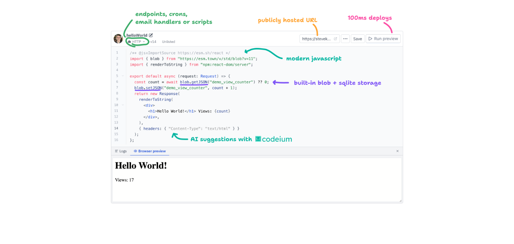
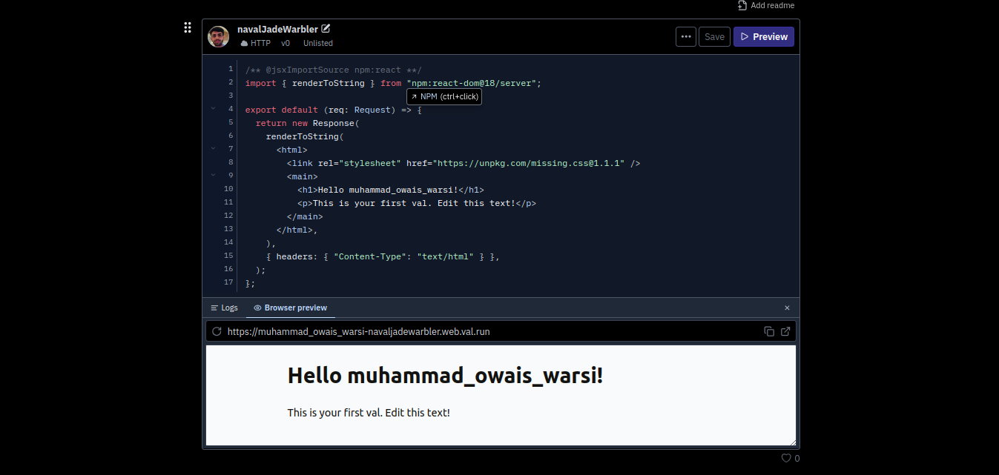
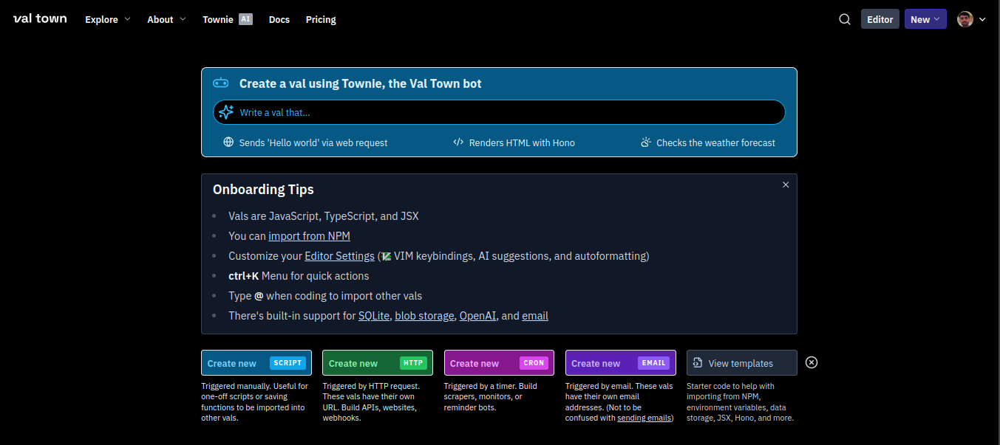
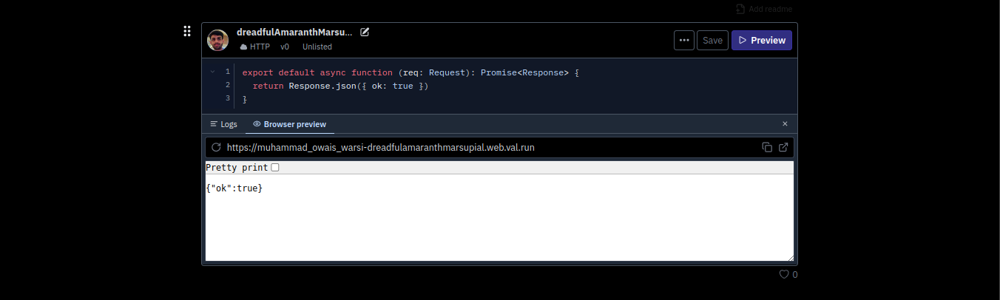

In today's blog, we'll explore what Val Town is and see the amazing features they offer. So Let's get started...

## Introduction

Val Town is a social website for writing and deploying JavaScript/TypeScript. You can write scripts, serve HTML, and schedule cron jobs and emails.

You might be wondering, what exactly are vals?

"Vals are small JavaScript or TypeScript snippets of code, written in the browser and run on our servers."

## Interface Overview

As you visit their site val.town, you'll see a quote that summarizes the purpose of Val Town: "If GitHub Gist could run and AWS was fun."

As a new user, you need to sign up to start creating amazing vals.

Before that we can see a basic layout of val and features it provides.

You can use Postman's Collection Runner to test your API Performance.



After signing up, you'll see a simple interface where you can view your first created val.



It is essentially an HTTP val that serves an HTML page on the web.



From here, you can create and deploy new vals and start working on them. Simply click on "Create New Script" or "HTTP" based on your needs.

Once you create and deploy a val, you will see your newly created val below. There will be a small editor and a preview window.



From the top left side, you can change your val name, val type, and even make it unlisted or public.

Once it's public, people can contribute and raise pull requests to your val.

That's a basic overview of the interface. Now, we will explore different types of val templates and build a personal linktree using Val Town.

Let’s jump into some hands-on action with Val Town.

## Personal Linktree

**Step 1 :** Create a new HTTP Val. After few seconds you new HTTP Val will be deployed and you can start working on it. Which will look something like


**Step 2 :** No we will be using React for creating a linktree and for that we have to import some modules.

```js
import { renderToString } from "npm:react-dom/server";
import React from "https://esm.sh/react";
import { createRoot } from "https://esm.sh/react-dom/client";
```

**Step 3 :** After that we will create an App function, and will setup the HTTP server.

```js
function App () {
    return (
        <h1>Welcome to val.town</h1>
    )
}

function client() {
  createRoot(document.getElementById("root")).render(<App />);
}

if (typeof document !== "undefined") { client(); }

async function server(request: Request): Promise<Response> {
  return new Response(
    `
    <!DOCTYPE html>
    <html lang="en">
      <head>
        <meta charset="UTF-8">
        <meta name="viewport" content="width=device-width, initial-scale=1.0">
        <title>New Val</title>
        <link rel="stylesheet" href="https://cdnjs.cloudflare.com/ajax/libs/font-awesome/6.0.0-beta3/css/all.min.css">
        {'<style>${css}</style>'}
      </head>
      <body>
        <div id="root"></div>
        <script type="module" src="${import.meta.url}"></script>
      </body>
    </html>
  `,
    {
      headers: { "content-type": "text/html" },
    },
  );
}
```

Now, after setting up the following things, we can start modifying our App function.

```js
function App() {
  const links = [
    { name: "Portfolio", url: "" },
    { name: "Twitter", url: "" },
    { name: "GitHub", url: "" },
    { name: "LinkedIn", url: "" },
    { name: "Blogs", url: "" },
  ];
  return (
    <div className="container">
      
      <h1>Name</h1>
      <p>Small Description about yourself</p>
      {links.map((link, index) => (
        <a key={index} href={link.url} className="link-button" target="_blank" rel="noopener noreferrer">
          <i className={`fab ${link.name}`}></i> {link.name}
        </a>
      ))}
    </div>
  );
}
```

To style this up we can add CSS. Note that the CSS is already being used in the server function in the `style` tag.

```js
const css = `
  body {
    font-family: 'Arial', sans-serif;
    background: linear-gradient(135deg, #e0c3fc 0%, #8ec5fc 100%);
    margin: 0;
    padding: 0;
    display: flex;
    justify-content: center;
    align-items: center;
    min-height: 100vh;
  }
  .container {
    background-color: white;
    border-radius: 20px;
    padding: 40px 20px;
    box-shadow: 0 10px 30px rgba(0, 0, 0, 0.1);
    text-align: center;
    max-width: 400px;
    width: 85%;
    border: 2px solid #8e44ad;
    margin: 20px auto;
  }
  .profile-img {
    width: 120px;
    height: 120px;
    border-radius: 50%;
    margin-bottom: 20px;
    border: 3px solid #8e44ad;
    box-shadow: 0 5px 15px rgba(0, 0, 0, 0.1);
  }
  h1 {
    margin: 10px 0;
    color: #8e44ad;
    font-size: 2em;
  }
  p {
    color: #555;
    margin-bottom: 30px;
    font-size: 1.1em;
  }
  .link-button {
    display: block;
    background-color: #8e44ad;
    color: white;
    padding: 14px 20px;
    margin: 10px 0;
    border-radius: 10px;
    text-decoration: none;
    transition: all 0.3s ease;
    font-weight: bold;
  }
  .link-button:hover {
    background-color: #732d91;
    transform: translateY(-2px);
    box-shadow: 0 5px 15px rgba(142, 68, 173, 0.3);
  }
  .link-button i {
    margin-right: 10px;
  }
  .footer {
    margin-top: 30px;
    font-size: 0.8em;
    color: #999;
  }
  .footer a {
    color: #8e44ad;
    text-decoration: none;
  }
  .footer a:hover {
    text-decoration: underline;
  }
  @media (max-width: 480px) {
    .container {
      width: 90%;
      padding: 30px 15px;
    }
    h1 {
      font-size: 1.8em;
    }
  }
`;
```

Now click on "Save" and "Preview" in the top right corner, and you will see your personal linktree. Congratulations 🎉🎉, you have created your first val.

I hope you now have a clear idea of how to create vals and work on them. You can explore more val templates like cron scheduling and email.

Check out the features and learn more about Val Town [here](https://docs.val.town/).

There's even a built-in AI for Val Town called Townie. It can create full-stack web apps in seconds. Give it a try.

## Conclusion
In this guide, we learned about val.town. We created our first HTTP val and explored the different val templates it offers.

Hope you enjoyed reading this blog. If you found it helpful, please share it with others.

Thanks for reading ❤️
